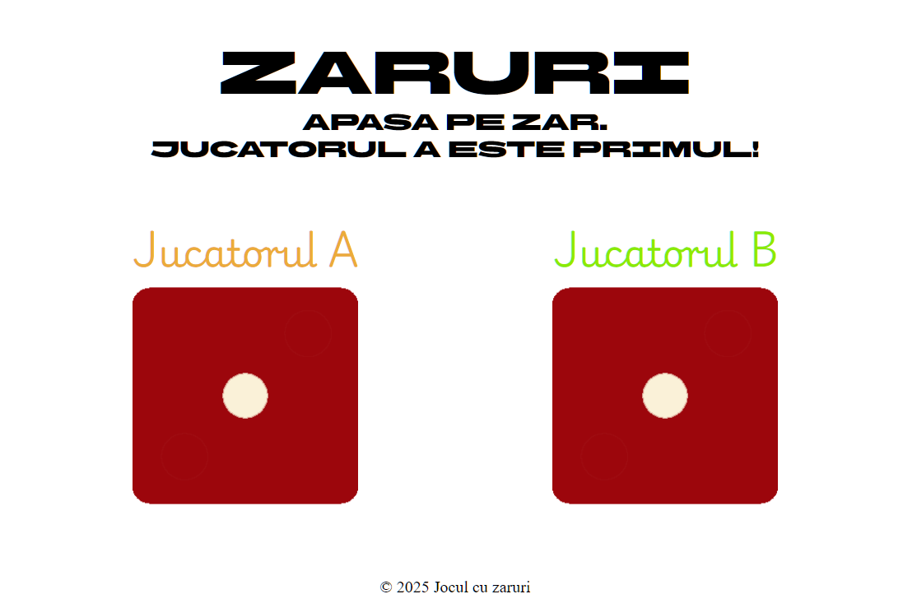

# Dicee game

## Table of contents

- [Overview](#overview)
- [The challenge](#the-challenge)
- [Screenshot](#screenshot)
- [Links](#links)
- [My process](#my-process)
- [Built with](#built-with)

## Overview

### The challenge

Users should be able to:
- View the optimal layout depending on their device's screen size

### Screenshot

### Links

- Live Site URL: https://gogu69.github.io/dicee/

## My process

1. The project started as a minimalist dice game without a specific design, but with full responsiveness across resolutions and orientations (portrait and landscape).
2.  The focus was on functionality rather than aesthetics—colors were chosen randomly, without deliberate design intent.
3.  The main goal was to integrate simple JavaScript functions into a document built with HTML and CSS.

### Built with

- CSS
- Flexbox
- Grid
- Responsive
- HTML
- JS